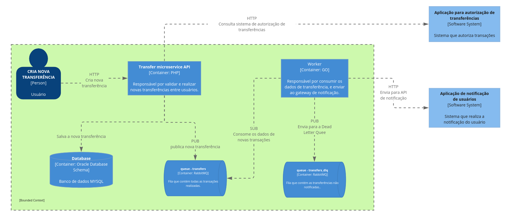

## Transfer microservice

O Transfer Microservice (apelido) Api Responsável por realizar transferência entre usuários.

## Repositório do Worker

https://github.com/andreluizmicro/go-transfer-worker

## Arquitetura

### Executando a aplicação passo a passo

rodar os comandos abaixo:

1- Realizar o build da aplicação:

    make docker-build
    
2 - Instalação de dependências:

    make docker-install

3 - Executando aplicação:

    make docker-up

4 - Rodar as migrations e seeders (OBS: Apenas para auxiliar o projeto, seu uso deve ser evitado por riscos de segurança).

    make docker-migrate

### Comandos do arquivo Makefile

Para auxiliar na configuração do projeto temos um arquivoo `Makefile` com ele é possível executar todas as configurações necessárias para que a aplicação funcione.

para executar os comando abaixo basta digitar antes do comando:

Exemplo:

    make <nome do comando definido no makefile>

Principais comandos:

- `docker-build`: Faz o build do projeto
- `docker-up`: Sobre os containers da aplicação
- `docker-down`: Para todos os containers da aplicação
- `docker-bash`: Acessa o bash do container da aplicação
- `docker-format`: Faz a formatação dos arquivos php
- `docker-test`: Executa todos os testes da aplicação
- `docker-test-coverage`: Executa os testes e gera um relatório de cobertura dos testes

### Documentação

A pasta `docs` contém o arquivo de collection para o postman que facilita a realização dos testes da API.

### Configuração RabbitMQ

1. Criar uma exchange do tipo `fanout` chamada `transfer_exchange`.
2. Criar a queue chamada `transfers`
